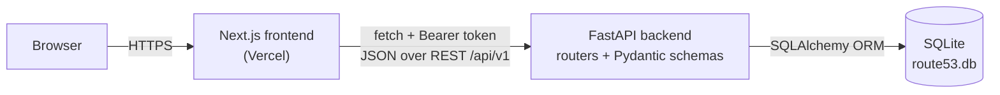
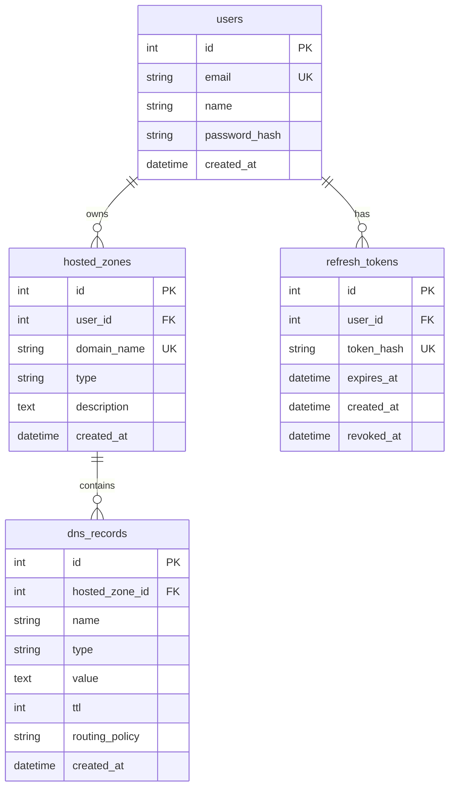

# AWS Route 53 Clone

A full-stack clone of the AWS Route 53 console. It recreates the core **hosted zone** and **DNS record** workflows with a Next.js frontend, a FastAPI backend, and SQLite persistence.

**Live demo:** https://aws-route-53-clone-ten.vercel.app/login

## Contents

- [Features](#features)
- [Tech Stack](#tech-stack)
- [Setup Instructions](#setup-instructions)
- [Architecture Overview](#architecture-overview)
- [Database Schema](#database-schema)
- [API Overview](#api-overview)
- [Demo](#demo)

## Features

- **Authentication:** sign up, log in and log out, with Argon2 password hashing, JWT access tokens and rotating refresh tokens.
- **Hosted zones:** create, view, edit and delete Public or Private zones, with search and pagination. Every user sees only their own zones.
- **DNS records:** full CRUD inside a hosted zone for `A`, `AAAA`, `CNAME`, `CAA`, `MX`, `TXT`, `NS`, `DS`, `NAPTR`, `PTR`, `SRV` and `SOA`, with value validation specific to each record type.
- **Console look and feel:** AWS-style top bar, sidebar, breadcrumbs, tables, forms, modals and flash notifications. Sections beyond hosted zones (health checks, resolver, and so on) are "Coming soon" placeholders.
- **Extras:** BIND zone-file import, JSON and BIND export, bulk record deletion, dark mode, and keyboard shortcuts.

| Shortcut | Action |
| --- | --- |
| `/` | Focus the filter box |
| `n` | Open the "create" action on the current page |
| `g` | Go to Hosted zones |
| `Esc` | Close the open modal |

## Tech Stack

| Layer | Technology |
| --- | --- |
| Frontend | Next.js 16 (App Router), React 18, TypeScript |
| Backend | FastAPI, Pydantic v2, SQLAlchemy 2, Uvicorn |
| Database | SQLite (`backend/route53.db`) |
| Auth | JWT (`python-jose`), Argon2 (`passlib`), HttpOnly cookies |
| Tooling | `uv` (Python), `npm` (Node) |
| Hosting | Frontend on Vercel |

## Setup Instructions

### Prerequisites

- **Python 3.13+** and [**uv**](https://docs.astral.sh/uv/). If you don't have Python 3.13, `uv sync` will download a matching version for you.
- **Node.js 20.9+** and npm (required by Next.js 16).

### 1. Clone the repository

```bash
git clone https://github.com/JangraShivam/AWS-ROUTE53-CLONE.git
cd AWS-ROUTE53-CLONE
```

### 2. Backend

```bash
cd backend
uv sync
```

Create `backend/.env`. `SECRET_KEY` is **required**; the app will not start without it.

```env
SECRET_KEY=replace-with-a-long-random-string
```

You can generate a key with:

```bash
python -c "import secrets; print(secrets.token_urlsafe(32))"
```

Optional settings, shown with their defaults:

```env
ALGORITHM=HS256
ACCESS_TOKEN_EXPIRE_MINUTES=60
REFRESH_TOKEN_EXPIRE_DAYS=7
```

Start the API **from the `backend/` directory** (the `.env` file and the SQLite database are both resolved relative to it):

```bash
uv run uvicorn app.main:app --reload
```

- API: http://localhost:8000
- Interactive docs (Swagger UI): http://localhost:8000/docs
- The database file `route53.db` and all tables are created automatically on first start.

### 3. Frontend

In a second terminal:

```bash
cd frontend
npm install
```

Create `frontend/.env.local`:

```env
NEXT_PUBLIC_API_URL=http://localhost:8000/api/v1
```

> **Important:** the value must include the `/api/v1` prefix. All backend routes are mounted under it, so pointing the frontend at `http://localhost:8000` alone returns 404 for every request.

```bash
npm run dev
```

The app runs at http://localhost:3000.

### 4. Try it

1. Open http://localhost:3000 and choose **Create a new AWS account**. Enter an email, an account name and a password of at least 8 characters.
2. You are signed in automatically and land on **Hosted zones**.
3. Create a hosted zone, open it, and add some DNS records.

### Sanity checks

```bash
# Backend: byte-compile all modules
cd backend && uv run python -m compileall app

# Frontend: production build with type checking
cd frontend && npm run build
```

### Environment variables

| Variable | Where | Required | Default | Purpose |
| --- | --- | --- | --- | --- |
| `SECRET_KEY` | `backend/.env` | Yes | none | Signs JWT access tokens |
| `ALGORITHM` | `backend/.env` | No | `HS256` | JWT signing algorithm |
| `ACCESS_TOKEN_EXPIRE_MINUTES` | `backend/.env` | No | `60` | Lifetime of the JWT |
| `REFRESH_TOKEN_EXPIRE_DAYS` | `backend/.env` | No | `7` | Lifetime of a refresh token |
| `NEXT_PUBLIC_API_URL` | `frontend/.env.local` | Yes for local dev | `http://localhost:8000` | Base URL of the API, **including `/api/v1`** |

## Architecture Overview



### Project structure

```
backend/
  app/
    main.py          App factory, CORS, router registration, table creation
    database.py      SQLAlchemy engine, session factory, Base
    core/            Settings (config.py) and auth utilities (security.py)
    models/          SQLAlchemy models: User, RefreshToken, HostedZone, DNSRecord
    schemas/         Pydantic request/response models and DNS validation rules
    routers/         Route handlers: auth, hosted_zones, dns_records
    services/        Service-layer helpers
    repositories/    Database helper functions
  pyproject.toml     Python dependencies (managed by uv)
frontend/
  app/               Next.js App Router pages
    login/ signup/                       Auth pages
    route53/hosted-zones/                Zone list, create page, and [id] record view
    route53/[section]/                   "Coming soon" placeholder for other nav items
  components/        Shell (top bar, sidebar, shortcuts, theme) and shared UI (Modal, Flash, Pager)
  lib/               api.ts (API client and type mapping) and auth.tsx (auth context)
```

### Frontend

- Built with the Next.js App Router. Pages are client components that fetch data through a single API client, `lib/api.ts`.
- `lib/api.ts` is the only place that talks to the backend. It maps backend fields (for example `domain_name`) to UI types (for example `name`), sends `credentials: "include"`, and attaches the stored token as an `Authorization: Bearer` header.
- `lib/auth.tsx` provides an auth context. On login the session and token are kept in `localStorage`; the `Shell` component redirects unauthenticated visitors to `/login`.
- Search, filtering and pagination are performed **client-side** on the full list returned by the API.
- The theme (light or dark) is stored in `localStorage` and applied through a `data-theme` attribute.

### Backend

- **Routers** (`app/routers`) define the HTTP endpoints, enforce authentication through the `get_current_user` dependency, and query the database with a per-request SQLAlchemy session.
- **Schemas** (`app/schemas`) validate and normalise input before it reaches the database. Domain names are lower-cased and stripped of a trailing dot, and each DNS record type has its own value validator.
- **Models** (`app/models`) map the four tables described below.
- **Startup:** `main.py` calls `Base.metadata.create_all`, then runs a small SQLite-only check (`ensure_sqlite_schema`) that adds columns missing from older database files.
- `services/` and `repositories/` contain reusable data-access helpers; the current routers query the session directly.

### Authentication flow

1. `POST /auth/login` verifies the password (Argon2) and returns a signed JWT in the response body. It also sets two **HttpOnly** cookies: `access_token` and `refresh_token`.
2. The refresh token is a random value. Only its **SHA-256 hash** is stored in the database.
3. For protected routes, `get_current_user` accepts the token from either the `access_token` cookie or an `Authorization: Bearer` header. The frontend uses the Bearer header.
4. `POST /auth/refresh` **rotates** the refresh token: the old one is revoked, and a new refresh token and access token are issued.
5. `POST /auth/logout` revokes the refresh token and clears both cookies.

### Data ownership

Hosted zones belong to a user. Every zone and record query is filtered by the signed-in user's ID, so another user's zone or record returns `404 Not Found`, as if it did not exist. Records are always accessed through their parent zone.

## Database Schema

SQLite, managed with SQLAlchemy. Tables are created automatically at startup.



### `users`

| Column | Type | Constraints | Notes |
| --- | --- | --- | --- |
| `id` | integer | PK | |
| `email` | varchar(255) | unique, not null | |
| `name` | varchar(100) | not null | Shown as the account name in the console |
| `password_hash` | varchar(255) | not null | Argon2 hash; plain-text passwords are never stored |
| `created_at` | datetime | not null | Defaults to current UTC time |

### `refresh_tokens`

| Column | Type | Constraints | Notes |
| --- | --- | --- | --- |
| `id` | integer | PK | |
| `user_id` | integer | FK → `users.id`, not null | |
| `token_hash` | varchar(64) | unique, not null | SHA-256 hex digest of the token |
| `expires_at` | datetime | not null | `REFRESH_TOKEN_EXPIRE_DAYS` after creation |
| `created_at` | datetime | not null | |
| `revoked_at` | datetime | nullable | Set on logout or when the token is rotated |

### `hosted_zones`

| Column | Type | Constraints | Notes |
| --- | --- | --- | --- |
| `id` | integer | PK | |
| `user_id` | integer | FK → `users.id`, not null | Owner |
| `domain_name` | varchar(255) | unique, not null | Stored lower-case with no trailing dot |
| `type` | varchar(20) | not null, default `Public` | `Public` or `Private` |
| `description` | text | nullable | Up to 256 characters |
| `created_at` | datetime | not null | |

### `dns_records`

| Column | Type | Constraints | Notes |
| --- | --- | --- | --- |
| `id` | integer | PK | |
| `hosted_zone_id` | integer | FK → `hosted_zones.id`, not null | |
| `name` | varchar(253) | not null | Empty string means the zone apex (`@`) |
| `type` | varchar(10) | not null | One of the 12 supported record types |
| `value` | text | not null | Multiple values are stored one per line |
| `ttl` | integer | not null, default `300` | 0 to 2,147,483,647 |
| `routing_policy` | varchar(50) | not null, default `Simple routing` | `Simple routing`, `Weighted`, `Latency`, `Failover` or `Geolocation` |
| `created_at` | datetime | not null | |

### Schema notes

- `domain_name` is unique across **all users**, not just per user. Two users cannot create the same zone.
- Deleting a hosted zone also deletes all of its DNS records.
- A zone's `record_count` is computed at request time and is not stored in the table.

## API Overview

- **Base URL:** `http://localhost:8000/api/v1` locally
- **Interactive docs:** `http://localhost:8000/docs`
- **Format:** JSON request and response bodies
- **Auth:** endpoints marked 🔒 require a valid access token, sent as `Authorization: Bearer <token>` or through the `access_token` cookie

### Auth

| Method | Endpoint | Auth | Description | Success |
| --- | --- | --- | --- | --- |
| `POST` | `/auth/signup` | | Register with `email`, `name`, `password` (8 to 72 characters) | `201` |
| `POST` | `/auth/login` | | Log in with `email`, `password`. Returns `{message, token}` and sets the auth cookies | `200` |
| `POST` | `/auth/refresh` | cookie | Rotate the refresh token and issue a new access token | `200` |
| `POST` | `/auth/logout` | | Revoke the refresh token and clear the cookies | `200` |

### Hosted zones

| Method | Endpoint | Auth | Description | Success |
| --- | --- | --- | --- | --- |
| `GET` | `/hosted-zones/` | 🔒 | List the current user's zones, each with a `record_count` | `200` |
| `POST` | `/hosted-zones/` | 🔒 | Create a zone: `domain_name`, `type` (`Public` or `Private`, default `Public`), optional `description` | `201` |
| `GET` | `/hosted-zones/{zone_id}` | 🔒 | Get one zone | `200` |
| `PUT` | `/hosted-zones/{zone_id}` | 🔒 | Partially update a zone | `200` |
| `DELETE` | `/hosted-zones/{zone_id}` | 🔒 | Delete a zone and all of its records | `204` |

### DNS records

| Method | Endpoint | Auth | Description | Success |
| --- | --- | --- | --- | --- |
| `GET` | `/hosted-zones/{zone_id}/records/` | 🔒 | List records in a zone | `200` |
| `POST` | `/hosted-zones/{zone_id}/records/` | 🔒 | Create a record: `name`, `type`, `value`, optional `ttl` (default 300) and `routing_policy` | `201` |
| `GET` | `/hosted-zones/{zone_id}/records/{record_id}` | 🔒 | Get one record | `200` |
| `PUT` | `/hosted-zones/{zone_id}/records/{record_id}` | 🔒 | Partially update a record | `200` |
| `DELETE` | `/hosted-zones/{zone_id}/records/{record_id}` | 🔒 | Delete a record | `204` |

### Validation rules

- **Domain names** must be valid (for example `example.com`). They are lower-cased and a trailing `.` is removed.
- **Record names:** `@` or an empty string refers to the zone apex. Each label may be up to 63 characters.
- **Uniqueness:** a zone cannot have two records with the same name and type.
- **CNAME exclusivity:** a `CNAME` cannot share a name with any other record, and no other record can share a name with an existing `CNAME`.
- **Record values** are checked per type. For example, `A` needs IPv4 addresses, `AAAA` needs IPv6 addresses, `MX` uses `priority host`, and `SRV` uses `priority weight port target`. Multi-value records put one value per line.

### Error responses

| Status | Meaning |
| --- | --- |
| `400` | Duplicate resource (email, zone, or record name/type) or a CNAME conflict |
| `401` | Missing, invalid or expired credentials |
| `404` | Zone or record not found, including ones owned by another user |
| `409` | `POST /auth/login` called while already signed in. Log out first |
| `422` | Request body failed validation |

Errors use the shape `{"detail": "..."}`. Validation errors (`422`) return a list of problems in `detail`.

### Example

```bash
BASE=http://localhost:8000/api/v1

# Sign up and log in
curl -X POST $BASE/auth/signup -H "Content-Type: application/json" \
  -d '{"email":"me@example.com","name":"Me","password":"password123"}'

TOKEN=$(curl -s -X POST $BASE/auth/login -H "Content-Type: application/json" \
  -d '{"email":"me@example.com","password":"password123"}' | python3 -c "import sys,json; print(json.load(sys.stdin)['token'])")

# Create a hosted zone
curl -X POST $BASE/hosted-zones/ \
  -H "Authorization: Bearer $TOKEN" -H "Content-Type: application/json" \
  -d '{"domain_name":"example.com","type":"Public","description":"Demo zone"}'

# Add an A record to zone 1
curl -X POST $BASE/hosted-zones/1/records/ \
  -H "Authorization: Bearer $TOKEN" -H "Content-Type: application/json" \
  -d '{"name":"www","type":"A","value":"203.0.113.10","ttl":300}'
```

## Demo

**Live app:** https://aws-route-53-clone-ten.vercel.app/login

To explore it:

1. Open the link and select **Create a new AWS account** to register, or sign in if you already have an account.
2. On **Hosted zones**, click **Create hosted zone** and add a domain such as `example.com`.
3. Open the zone to add, edit and delete DNS records, filter them, export to JSON or BIND, or import a BIND zone file.
4. Try the dark mode toggle in the top bar and the keyboard shortcuts listed above.
